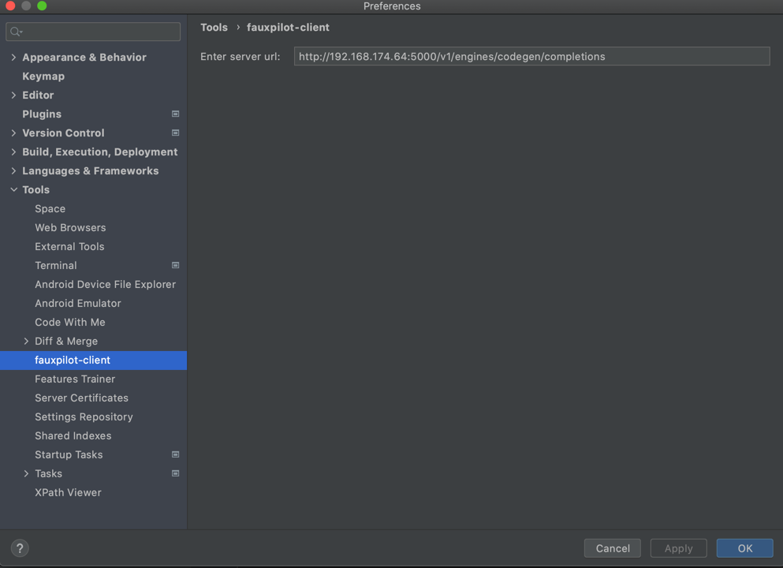
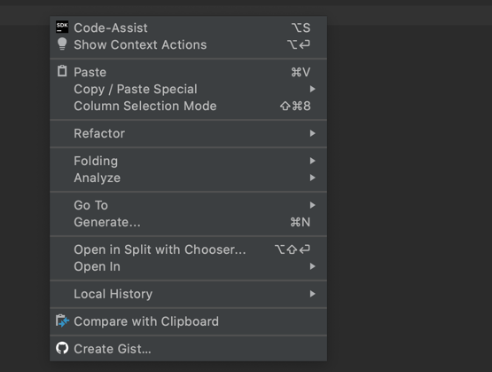

# IntelliJ IDEA - Fauxpilot Client

## Quickstart

* To use the fauxpilot client, you need to first complete the deployment of the fauxpilot server. You need to set the service address in the settings file ->Settings ->Tools ->fauxpilot client, and fill in the following information: http://192.168.174.64:5000/v1/engines/codegen/completions
* You can generate subsequent code by selecting the specified content or by generating code from the previous text.
* The shortcut key for triggering code prediction is alt+s.

## Others

* Client is build around [Fauxpilot server](https://github.com/fauxpilot/fauxpilot)

## Using snapshots

* Change your Fauxpilot server

